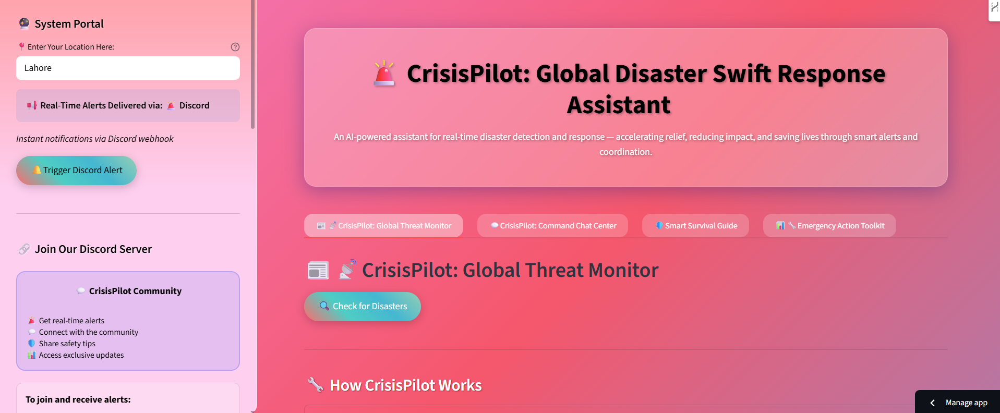
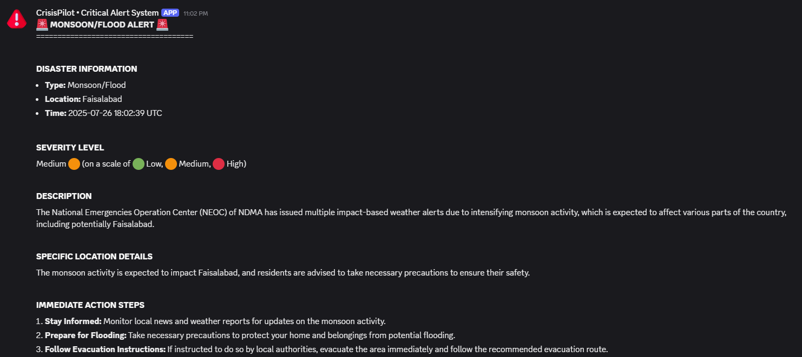
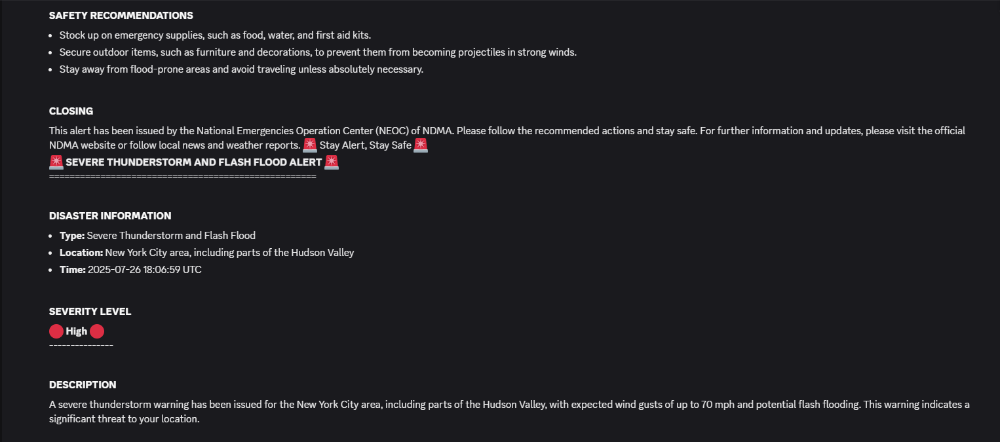
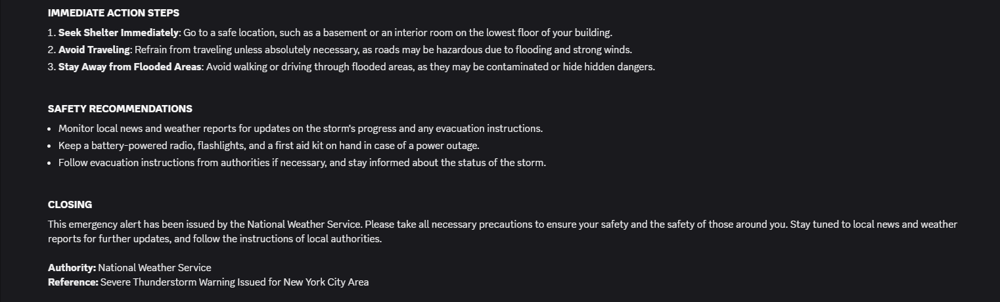

# 🚨 CrisisPilot: Global Disaster Swift Response Assistant

**🌍 Protecting communities worldwide through intelligent disaster response**  
**🏢 Developed by Team Beacon Builders**


## 📋 Overview

CrisisPilot is an advanced agentic AI system that revolutionizes disaster response through real-time monitoring, intelligent analysis, and instant alert delivery. Built with cutting-edge AI technologies, it provides communities with critical information when disasters strike.

### 🎯 Problem Statement
Natural disasters disrupt communication systems, delay emergency response, and leave communities without critical information. Traditional alert systems are fragmented, slow, and lack intelligent analysis capabilities.

### 💡 Solution
An AI-powered multi-agent system that monitors news sources, analyzes threats using advanced NLP, and delivers instant professional alerts through modern communication platforms.


## 🏗️ System Architecture

### 🤖 Multi-Agent AI Framework

**1. News Agent** - Real-time disaster news monitoring  
**2. Alert Agent** - AI-powered threat analysis and decision making  
**3. Alert Message Agent** - Professional emergency message generation  
**4. Chat Agent** - Interactive disaster assistance and safety guidance  
**5. Alert Sender** - Multi-platform alert delivery system

### 🔄 Workflow
```
News Monitoring → AI Analysis → Threat Assessment → Alert Generation → Instant Delivery
```

## 🛠️ Technology Stack

### **🧠 AI & Machine Learning**
- **Groq API** - LLaMA-3.3-70B-Versatile for advanced NLP and reasoning
- **LangChain** - Agent orchestration, prompt engineering, and chain management
- **Pydantic** - Structured data validation and response parsing

### **🔍 Data Sources & APIs**
- **Serper API** - Real-time Google News integration for disaster monitoring
- **DuckDuckGo Search** - Backup news source with no API requirements
- **Mock Data System** - Comprehensive testing and development support

### **🖥️ Frontend & Interface**
- **Streamlit** - Modern web application with interactive dashboard
- **Custom CSS** - Glassmorphism design with animated gradient backgrounds
- **Responsive UI** - Multi-tab interface optimized for emergency use

### **📢 Alert Delivery Systems**
- **Discord Webhooks** - Primary alert platform with community integration
- **Environment Management** - Secure API key handling with dotenv

### **🗃️ Data Processing**
- **Requests** - HTTP client for API communications
- **JSON Processing** - Structured data handling and parsing
- **Error Handling** - Comprehensive exception management and fallbacks


## 🌟 Key Features

### 🚨 **Real-Time Disaster Monitoring**
- Continuous news scanning from multiple sources
- Location-based threat assessment
- Automated disaster classification and severity analysis

### 📱 **Intelligent Alert System**
- AI-generated professional emergency messages
- Instant Discord delivery with retry logic
- Community server integration for broader reach

### 💬 **Interactive AI Assistant**
- Context-aware emergency guidance
- Disaster-specific safety protocols
- Real-time chat support during emergencies

### 🛡️ **Emergency Preparedness Tools**
- Comprehensive disaster survival guides
- Interactive emergency kit checklists
- Family emergency plan generator
- Personal risk assessment system
## 🖥️ Live Streamlit App Preview

CrisisPilot provides an intuitive dashboard to monitor disasters and issue alerts in real-time.

**Here's how the app looks in action:**





## 📢 Discord Alerts

### **Real-Time Alert System**
CrisisPilot delivers professional emergency alerts directly to your Discord server with comprehensive information including disaster type, severity, location, and actionable safety guidance.

**Here's how a real-time alert looks in your Discord server:**





### **🔗 Join Our Discord Server**
To receive real-time alerts and stay connected with the CrisisPilot AI Network and its community:

1. **Click the invite link**: 👉 [Join CrisisPilot AI Network Discord Server](https://discord.gg/ffGSRJrT)
2. **Log in** to your Discord account (create one if needed)
3. **Accept the invitation** - you'll be automatically added to our server
4. **Navigate to channels**:
   - **#alerts** - Real-time emergency notifications
   - **#general** - Community discussions and support
   - **#safety-tips** - Disaster preparedness advice
   - **#updates** - System announcements
5. **Enable notifications** on your mobile device for instant emergency alerts


## 🚀 Quick Start

### **Installation**
```bash
git clone https://github.com/marianadeem755/CrisisPilot-Global-Disaster-Swift-Response-Assistant.git
cd crisisipilot
pip install -r requirements.txt
```

### **Configuration**
Create `.env` file:
```env
GROQ_API_KEY=your_groq_api_key_here
SERPER_API_KEY=your_serper_api_key_here  # Optional
DISCORD_WEBHOOK_URL=your_discord_webhook_url_here
```

### **Run Application**
```bash
streamlit run app.py
```


## 📁 Project Structure

```
crisisipilot/
├── .env                         # Environment variables
├── app.py                       # Main Streamlit app
├── config.py                    # Configuration settings
├── readme.md                    # Project documentation
├── requirements.txt             # Python dependencies
├── test_discord.py              # Discord integration test script
│
├── agents/                      # Agents responsible for different tasks
│   ├── __init__.py
│   ├── alert_agent.py
│   ├── alert_message_agent.py
│   ├── alert_sender.py
│   ├── chat_agent.py
│   └── news_agent.py
│
├── images/                      # Reference images or documentation support
│   ├── discord_alert_part1.png
│   ├── discord_alert_part2.png
│   └── discord_alert_part3.png
│
├── utils/                       # Utility modules
│   ├── __init__.py
│   ├── alert_sender.py
│   ├── parsers.py
│   └── templates.py

```
# 📖 How to Use CrisisPilot: Global Disaster Swift Response Assistant

## 🌍 Getting Started

- **Enter your location** in the main application dashboard to personalize alerts and risk assessments for your area  
- **Configure Discord webhook** in your settings to enable community alert sharing  
- Navigate through the following tabs to access all disaster response features:


## 📊 Monitor Active Disasters

### 🔴 Current Real-Time Features  
### 📡 Real-Time News Monitoring

- Live news fetching from **Serper API** + **DuckDuckGo** backup  
- Location-based disaster searches using multiple keyword combinations  
- Automatic fresh content filtering  

## 🚨 Instant Alert System

- Real-time **Discord notifications** via webhooks  
- Professional alert message generation using **Groq AI (Llama 3.3-70B)**  
- Immediate alert delivery with retry logic and error handling  

**View real-time alerts like:**  
> 🚨 *"DISASTER ALERT! Flood in Lahore – Severity: High"*

**Follow recommended actions:**  
- e.g., *"Avoid flooded areas"*

**Trigger Discord Alerts:**  
- Share warnings with your community instantly.


## 🔍 On-Demand Threat Detection

- Manual disaster scanning with **"Check for Disasters"** button  
- **AI-powered news analysis** for disaster identification  
- Severity assessment and risk categorization


## 🤖 Use the AI Disaster Assistant/Chatbot

### 💬 Live AI Chat Assistant

- Real-time conversational AI powered by **Groq LLM**  
- Context-aware responses with conversation memory  
- Emergency-specific guidance based on detected disasters

**Ask Safety Questions**  
Type queries like:  
- *"What should I do during an earthquake?"*  
- *"How to prepare for a flood?"*

**Get Instant Guidance**  
The AI provides step-by-step safety tips, e.g.:  
> *"Drop, cover, and hold on during quakes."*


## 📋 Smart Survival Guide

Quick-access disaster protocols:

### Floods  
- ✋ Never walk/drive through floodwater  
- ⬆️ Move to higher ground  
- 🔌 Avoid downed power lines

### Earthquakes  
- 🛌 Drop, cover, hold (under sturdy furniture)  
- 🪟 Stay away from windows

### Fires  
- 🚪 Check doors for heat before opening  
- 🧯 Use fire extinguishers (PASS method)

**Always:**  
- 📱 Save local emergency numbers  
- 🎒 Keep a go-bag ready (see Survival Kit section)


## 🔍 Personal Risk Assessment

### Identify Your Risks  
- Enter your location details to generate a **custom risk report**  
- e.g., *"Earthquake: Medium Risk"*  
- View prioritized threats: floods, earthquakes, etc., based on local data

### Recommended Actions  
**Medium/High-Risk Scenarios:**  
- Focus preparedness efforts  
- e.g., Secure furniture for earthquakes

**Low-Risk Scenarios:**  
- Maintain basic emergency kits

**Generate a Report:**  
- Click **"Generate Risk Assessment Report"**  
- Review your risk levels and tailored safety steps

## 🛡️ Emergency Preparedness Tools

### ✅ Survival SmartKit Checklist

Pack essentials like:  
- Water (1 gallon/person/day)  
- Flashlight, batteries, first aid kit  
- Non-perishable food (3-day supply)

Track completion progress:  
- e.g., *"Kit: 25% ready"*

### 👨‍👩‍👧 Family Emergency Plan

**Add Members:**  
- Names, ages, medical needs  

**Set Meeting Points:**  
- Local (e.g., *"University of Lahore"*)  
- Regional  

**Save Contacts:**  
- Primary/secondary emergency phone numbers

## 📚 Additional Resources

### Government & Apps

- [Ready.gov](https://www.ready.gov): Official preparedness guides  
- [FEMA App](https://www.fema.gov/mobile-app): Disaster alerts and shelters  
- [Red Cross App](https://www.redcross.org/get-help/how-to-prepare-for-emergencies/mobile-apps.html): First aid and real-time warnings

## 🔮 Future Expansion

### **Additional Alert Platforms**
*Due to hackathon time constraints, additional platforms planned for future releases:*

- **WhatsApp Business API** - Direct mobile messaging
- **Telegram Bot API** - Channel and group notifications  
- **Slack Webhooks** - Workplace emergency communication
- **SMS Services** - Twilio/AWS SNS integration
- **Email Services** - SendGrid/Mailgun support
- **Microsoft Teams** - Enterprise collaboration alerts


## 🛡️ Emergency Features

### **Disaster Coverage**
- Earthquakes, Floods, Hurricanes, Tornadoes
- Wildfires, Tsunamis, Winter Storms
- Infrastructure emergencies and more

### **Safety Tools**
- Interactive emergency preparedness checklists
- Disaster-specific survival guides
- Family emergency plan generator
- Personal risk assessment tools
- Emergency contact management


## 📊 System Capabilities

- **Response Time**: < 5 seconds for threat analysis
- **Alert Delivery**: < 10 seconds via Discord
- **Data Processing**: 100+ news articles per scan
- **Global Coverage**: Worldwide location support
- **24/7 Monitoring**: Continuous disaster surveillance


## 🏢 Team Beacon Builders

**🌍 Building safer communities through innovative disaster response technology**

*CrisisPilot represents our commitment to leveraging AI for humanitarian purposes, providing communities with the tools they need to stay safe during natural disasters.*

# CrisisPilot-Global-Disaster-Swift-Response-Assistant
